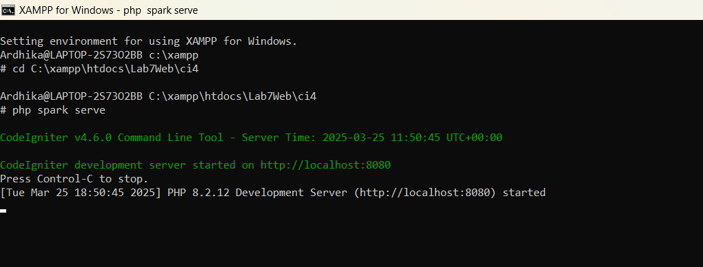
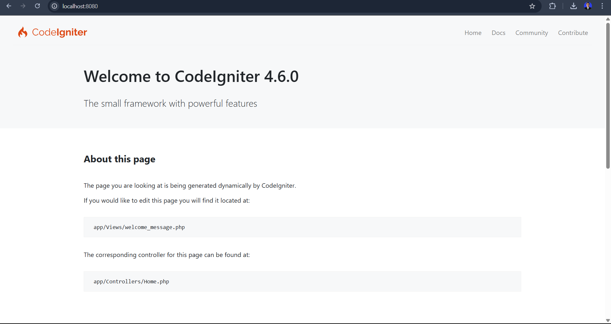
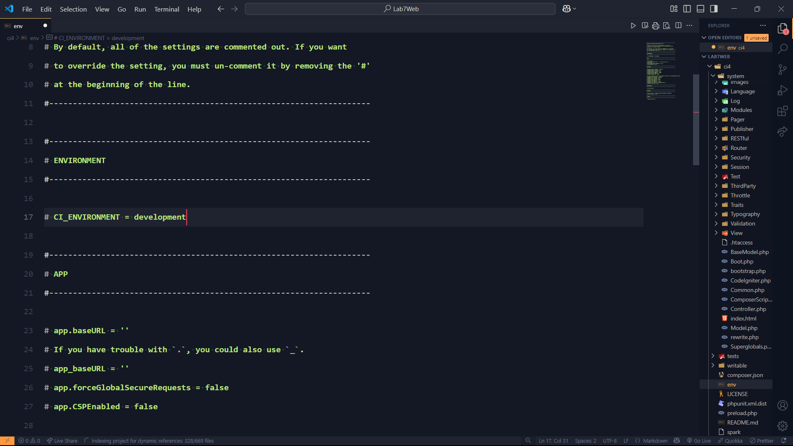
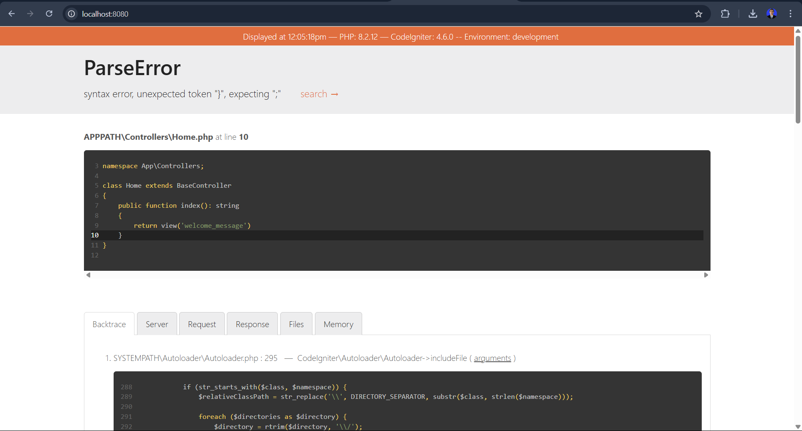
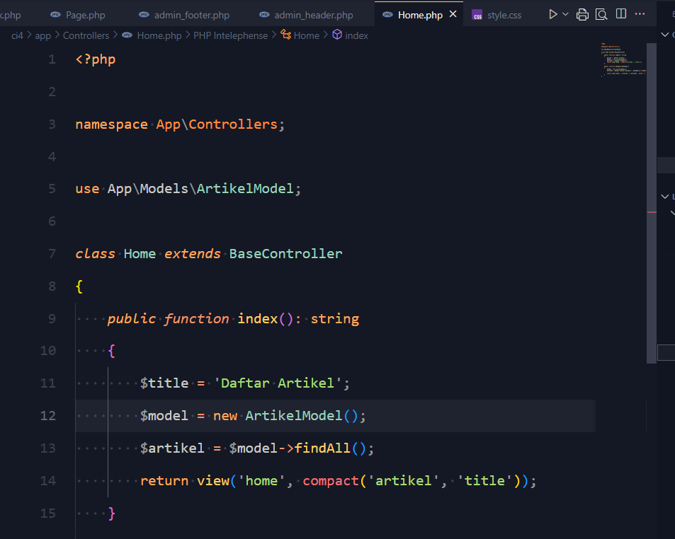
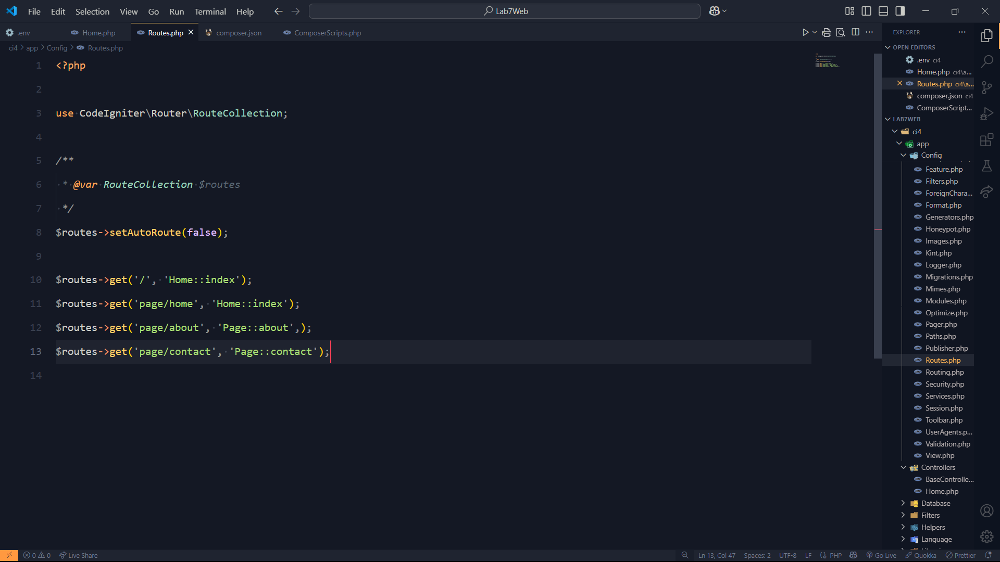
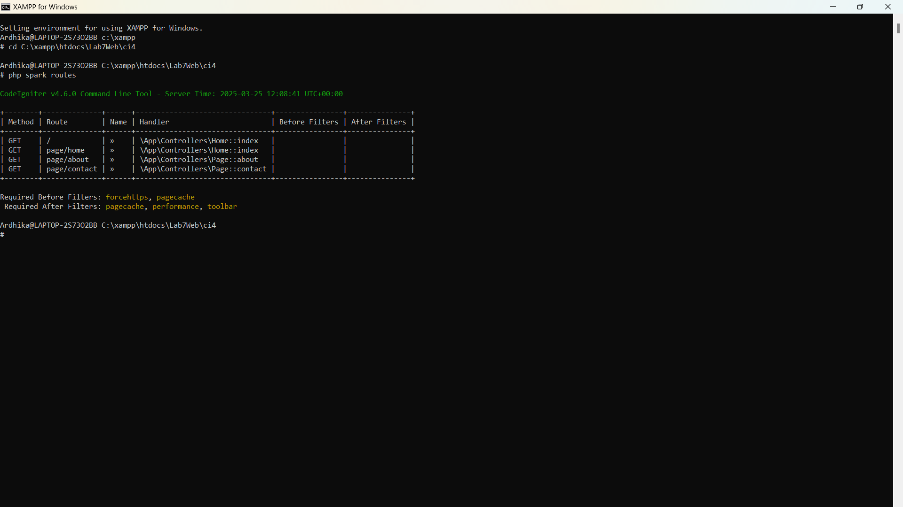
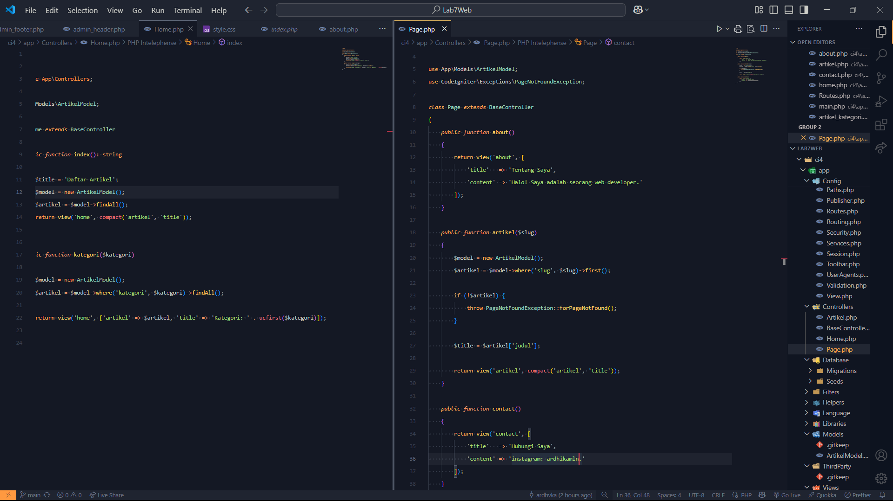

# Praktikum 1

1. Mengaktifkan Ekstensi di

```bash
  php.ini
```

Berikut adalah ekstensi PHP yang harus diaktifkan:

1. php-json → Diperlukan untuk bekerja dengan JSON.
2. php-mysqlnd → Native driver untuk MySQL.
3. php-xml → Diperlukan untuk bekerja dengan XML.
4. php-intl → Diperlukan untuk mendukung aplikasi multibahasa.
5. libcurl (opsional) → Diperlukan jika ingin menggunakan Curl.

##

Buka xampp file Config

```bash
  php.ini
```

Pastikan ekstensi berikut tidak dikomentari (hilangkan tanda ; di depannya jika ada):

```bash
extension=json
extension=mysqli
extension=xml
extension=intl
extension=curl
```


## Instalasi

### 1. Instalasi CodeIgniter

Instalasi dengan cara manual:

1. Unduh CodeIgniter → (https://codeigniter.com/download)
2. Extrak file zip Codeigniter ke direktori htdocs/Lab7Web
3. Ubah nama direktory framework-4.x.xx menjadi ci4.
4. Menjalankan CLI XAMPP
   Arahkan direktori sesuai dengan project → (xampp/htdocs/Lab7Web/ci4/)
   Perintah yang dapat dijalankan untuk memanggil CLI Codeigniter adalah: php spark serve Meluncurkan server pengembangan bawaan, Memungkinkan melihat aplikasi di browser (http://localhost:8080).

### 2. Menjalankan CLI XAMPP

- Arahkan direktori sesuai dengan project → (xampp/htdocs/Lab7Web/ci4/)
- Perintah yang dapat dijalankan untuk memanggil CLI Codeigniter adalah: php spark serve Meluncurkan server pengembangan bawaan, Memungkinkan melihat aplikasi di browser (http://localhost:8080).





### 3. Mengaktifkan Mode Debugging

Fitur debugging dari CodeIgniter 4 untuk memudahkan developer untuk mengetahui pesan error apabila terjadi kesalahan dalam membuat kode program. Mengaktifkan mode debugging dengan mengubah niai konfigurasi pada file
`env`, cari variable `CI_ENVIRONMENT` ubah menjadi `development`



Kemudian rename nama file `env → .env`

Contoh Error yang terjadi ketika menghapus function pada file app/Controller/Home.php





## 4. Routing dan Controllers

Routing dalam CodeIgniter 4 adalah proses yang menghubungkan permintaan (request) dari pengguna ke Controller yang sesuai untuk diproses. Routing ini memungkinkan kita menentukan bagaimana URL diterjemahkan menjadi aksi dalam aplikasi, sehingga setiap permintaan dapat diarahkan dengan benar.

#### Membuat Route baru (autoRoute(false)):

Secara default fitur autoRoute sudah aktif. Untuk mengubah status autoroute dapat mengubah nilai variabelnya. Untuk menonaktifkan ubah nilai true menjadi false. Nonaktifkan Auto Routing `($routes->setAutoRoute(false);)` ketika menjalankan di production.

tambahkan kode berikut dalam **app/Config/Routes.php**



Untuk mengetahui route yang ditambahkan sudah benar, buka CLI dan jalankan perintah `php spark routes:`



### Membuat Controllers:

tambahkan code berikut dalam **app/Controllers/Page.php & Home.page**


