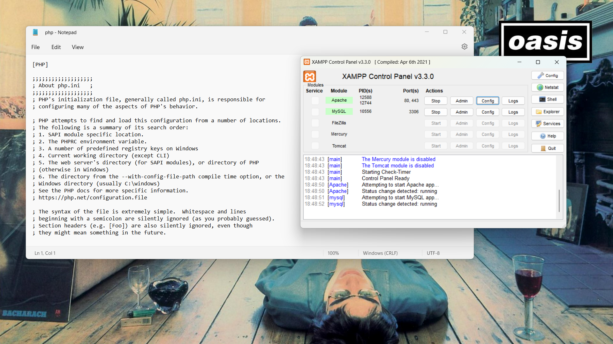

# Praktikum 1

1. Mengaktifkan Ekstensi di

```bash
  php.ini
```

Berikut adalah ekstensi PHP yang harus diaktifkan:

1. php-json → Diperlukan untuk bekerja dengan JSON.
2. php-mysqlnd → Native driver untuk MySQL.
3. php-xml → Diperlukan untuk bekerja dengan XML.
4. php-intl → Diperlukan untuk mendukung aplikasi multibahasa.
5. libcurl (opsional) → Diperlukan jika ingin menggunakan Curl.

##

Buka xampp file Config

```bash
  php.ini
```

Pastikan ekstensi berikut tidak dikomentari (hilangkan tanda ; di depannya jika ada):

```bash
extension=json
extension=mysqli
extension=xml
extension=intl
extension=curl
```


